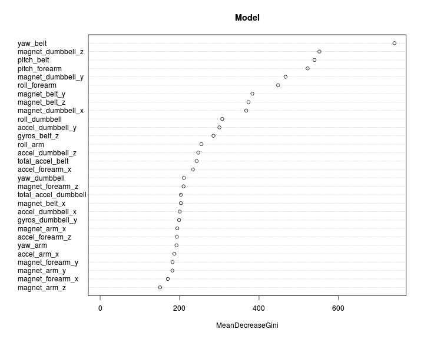
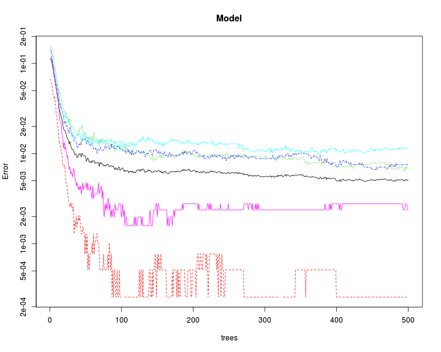

ML Assignment
---


### Load Data

```r
testData <- read.csv("pml-testing.csv", colClasses="character")
trainData <- read.csv("pml-training.csv", colClasses="character")
```


```r
dim(trainData)
```

```
## [1] 19622   160
```

```r
dim(testData)
```

```
## [1]  20 160
```

### Explore data
Explore the input dataset. Dataset contains of 160 columns.  
First column is entry id, second is 'user_name' and final 160th one is actual Class of exercise.  
More details about the dataset can be found here http://groupware.les.inf.puc-rio.br/har  
These three columns have to be extracted as factor. Other columsn 3:159 are numeric values.

```r
trainData[,3:159]<-apply(trainData[,3:159], 2, as.numeric)
trainData[,1]<-as.factor(trainData[,1])
trainData[,2]<-as.factor(trainData[,2])
trainData[,160]<-as.factor(trainData[,160])

testData[,3:159]<-apply(testData[,3:159], 2, as.numeric)
testData[,1]<-as.factor(testData[,1])
testData[,2]<-as.factor(testData[,2])
testData[,160]<-as.factor(testData[,160])
```

First few columns in the dataset tracks entry ID, timestamp, Date etc  
These do not help in deciding the activity. Hence, these are removed from the dataset.

```r
names(trainData[,1:7])
```

```
## [1] "X"                    "user_name"            "raw_timestamp_part_1"
## [4] "raw_timestamp_part_2" "cvtd_timestamp"       "new_window"          
## [7] "num_window"
```

```r
trainData <- trainData[,c(-1, -3:-7)]
testData <- testData[,c(-1, -3:-7)]
```


### Remove missing data

```r
unique(colSums(!is.na(trainData)))
```

```
##  [1] 19622   396   374     0   397   406   328   326   395   329   401
## [12]   404   402   405   322   321   323
```
Many of the columns in the dataset have a lot of missing values (NA)  
As a safety, we remove all columns which have more than half the data missing.

```r
selCol <- colSums(!is.na(trainData))> (nrow(trainData)/2)
trainData <- trainData[,selCol]
testData <- testData[,selCol]
dim(trainData)
```

```
## [1] 19622    54
```

```r
dim(testData)
```

```
## [1] 20 54
```


### Training and Testing

```r
set.seed(3433)
inTrain = createDataPartition(trainData$classe, p = 0.7, list=FALSE)
training = trainData[inTrain,]
testing = trainData[-inTrain,]
```
After removing the unwanted columns we get a dataset with 54 columnns

### Preprocess
**Check for low variance factors**  
It is quite possible that there might be some features which have very low variance  
We want to remove these since it will slow down the training process without adding any accuracy.  
'nearZeroVar' function checks if the descriptors are close to zero or have very low variance.

```r
nzv <- nearZeroVar(training, saveMetrics= TRUE)
sum(nzv$nzv)
```

```
## [1] 0
```
In this case, there were no descriptors with very low variance.  
Hence no descriptors are removed from the dataset.  
  
**Check for highly correlated factors**

```r
# Remove user_name and classe columns
filteredDescr <- training[,2:53]
descrCor <-  cor(filteredDescr)
highlyCorDescr <- findCorrelation(descrCor, cutoff = .95)
filteredDescr <- filteredDescr[,-highlyCorDescr]
dim(filteredDescr)
```

```
## [1] 13737    47
```

```r
# Add back user_name and classe columns
trainDescr <- cbind(filteredDescr, training[,c(1,54)])
dim(trainDescr)
```

```
## [1] 13737    49
```
Two columns were highly correlated and these are removed.  
Similarly, the training data is also cleaned up.

```r
filteredDescr <- testing[,2:53]
filteredDescr <- filteredDescr[,-highlyCorDescr]
testDescr <- cbind(filteredDescr, testing[,c(1,54)])
dim(testDescr)
```

```
## [1] 5885   49
```

### Train RandomForest

```r
# RandomForest
startTime <- Sys.time()
modFit <- randomForest(classe~., data=trainDescr)
endTime <- Sys.time()
endTime-startTime
```

```
## Time difference of 26.75119 secs
```

#### Display model

```r
modFit
```

```
## 
## Call:
##  randomForest(formula = classe ~ ., data = trainDescr) 
##                Type of random forest: classification
##                      Number of trees: 500
## No. of variables tried at each split: 6
## 
##         OOB estimate of  error rate: 0.5%
## Confusion matrix:
##      A    B    C    D    E  class.error
## A 3905    0    0    0    1 0.0002560164
## B   14 2640    4    0    0 0.0067720090
## C    0   14 2378    4    0 0.0075125209
## D    0    0   25 2226    1 0.0115452931
## E    0    0    2    4 2519 0.0023762376
```
From the model, we see that **Out of Bag** error was only 0.5%  
If there was no Overfitting, we should get a similar error on testing data  

```r
varImpPlot(modFit, main="Model")
```

 


```r
plot(modFit, log="y", main="Model")
```

 

### Apply model on test data

```r
accuracy <- mean(predict(modFit, newdata=testDescr) == testDescr$classe)
testError <- (1-accuracy)*100
testError
```

```
## [1] 0.7816483
```
There is only **0.8%** error on the test data.  
So, there was no overfitting with the model.

### Apply model to actual testing data to predict outcome

```r
filteredDescr <- testData[,2:53]
filteredDescr <- filteredDescr[,-highlyCorDescr]
testDescr <- cbind(filteredDescr, testData[,c(1,54)])
dim(testDescr)
```

```
## [1] 20 49
```

```r
# Final prediction
outcome <- predict(modFit, newdata=testDescr)
outcome
```

```
##  1  2  3  4  5  6  7  8  9 10 11 12 13 14 15 16 17 18 19 20 
##  B  A  B  A  A  E  D  B  A  A  B  C  B  A  E  E  A  B  B  B 
## Levels: A B C D E
```

